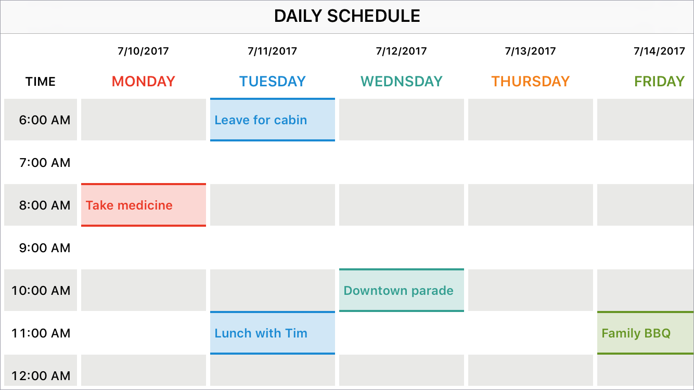
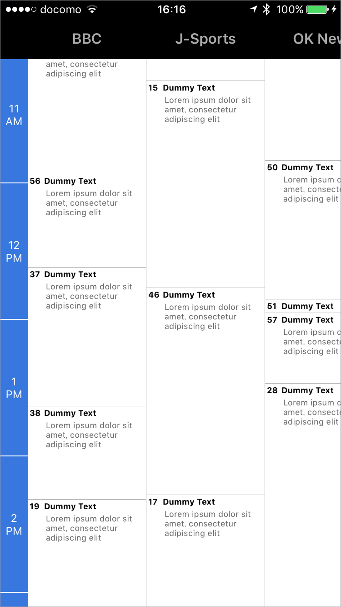
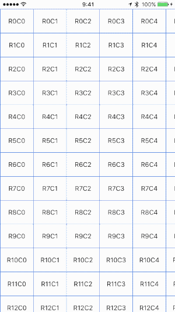
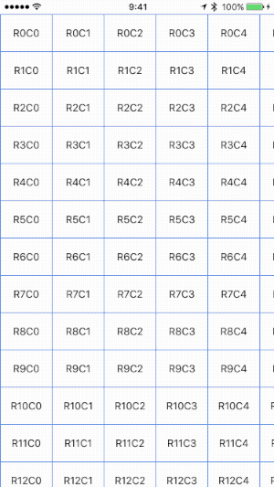
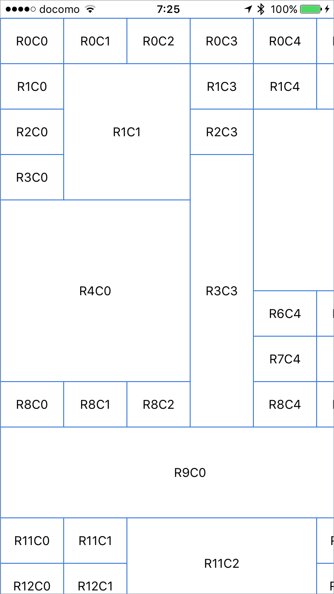
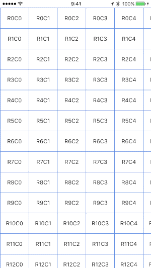

<p align="center">
  
</p>

<p align="center">
    <a href="https://travis-ci.org/kishikawakatsumi/SpreadsheetView">
        
    </a>
    <a href="https://codecov.io/gh/kishikawakatsumi/SpreadsheetView">
        
    </a>
    <a href="https://cocoapods.org/pods/SpreadsheetView">
        
    </a>
    <a href="http://cocoapods.org/pods/SpreadsheetView/">
        
    </a>
    <a href="https://github.com/Carthage/Carthage">
        
    </a>
</p>

----------------

Full configurable spreadsheet view user interfaces for iOS applications. With this framework, you can easily create complex layouts like schedule, Gantt chart, timetable as if you are using Excel.

</img>&nbsp;</img><br>
</img>&nbsp;
</img>

## Features
- [x] Fixed column and row headers
- [x] Merge cells
- [x] Circular infinite scrolling automatically
- [x] Customize gridlines and borders for each cell
- [x] Customize inter cell spacing vertically and horizontally
- [x] Fast scrolling, memory efficient
- [x] `UICollectionView` like API
- [x] Well unit tested

##### Find the above displayed examples in the [`Examples`](https://github.com/kishikawakatsumi/SpreadsheetView/tree/master/Examples) folder.

## Requirements
SpreadsheetView is written in Swift 5. Compatible with iOS 9.0+

## Installation

### CocoaPods
SpreadsheetView is available through [CocoaPods](https://cocoapods.org). To install
it, simply add the following line to your Podfile:

```ruby
pod 'SpreadsheetView'
```

### Carthage
For [Carthage](https://github.com/Carthage/Carthage), add the following to your `Cartfile`:

```ogdl
github "kishikawakatsumi/SpreadsheetView"
```

## Getting Started

The minimum requirement is connecting a data source to return the number of columns/rows, and each column width/row height.

```swift
import UIKit
import SpreadsheetView

class ViewController: UIViewController, SpreadsheetViewDataSource {
    @IBOutlet weak var spreadsheetView: SpreadsheetView!

    override func viewDidLoad() {
        super.viewDidLoad()
        spreadsheetView.dataSource = self
    }

    func numberOfColumns(in spreadsheetView: SpreadsheetView) -> Int {
        return 200
    }

    func numberOfRows(in spreadsheetView: SpreadsheetView) -> Int {
        return 400
    }

    func spreadsheetView(_ spreadsheetView: SpreadsheetView, widthForColumn column: Int) -> CGFloat {
      return 80
    }

    func spreadsheetView(_ spreadsheetView: SpreadsheetView, heightForRow row: Int) -> CGFloat {
      return 40
    }
}
```

## Usage
### Freeze column and row headers
Freezing a column or row behaves as a fixed column/row header.

#### Column Header
```swift
func frozenColumns(in spreadsheetView: SpreadsheetView) -> Int {
    return 2
}
```

</img>

#### Row Header
```swift
func frozenRows(in spreadsheetView: SpreadsheetView) -> Int {
    return 2
}
```

</img>

#### both
```swift
func frozenColumns(in spreadsheetView: SpreadsheetView) -> Int {
    return 2
}

func frozenRows(in spreadsheetView: SpreadsheetView) -> Int {
    return 2
}
```

</img>

### Merge cells
Multiple cells can be merged and then they are treated as one cell. It is used for grouping cells.

```swift
func mergedCells(in spreadsheetView: SpreadsheetView) -> [CellRange] {
    return [CellRange(from: (row: 1, column: 1), to: (row: 3, column: 2)),
            CellRange(from: (row: 3, column: 3), to: (row: 8, column: 3)),
            CellRange(from: (row: 4, column: 0), to: (row: 7, column: 2)),
            CellRange(from: (row: 2, column: 4), to: (row: 5, column: 8)),
            CellRange(from: (row: 9, column: 0), to: (row: 10, column: 5)),
            CellRange(from: (row: 11, column: 2), to: (row: 12, column: 4))]
}
```

</img>

### Circular Scrolling
Your table acquires infinite scroll just set `circularScrolling` property.

#### Enable horizontal circular scrolling
```swift
spreadsheetView.circularScrolling = CircularScrolling.Configuration.horizontally
```

#### Enable vertical circular scrolling
```swift
spreadsheetView.circularScrolling = CircularScrolling.Configuration.vertically
```

#### Both
```swift
spreadsheetView.circularScrolling = CircularScrolling.Configuration.both
```

</img>

If circular scrolling is enabled, you can set additional parameters that the option not to repeat column/row header and to extend column/row header to the left/top edges. `CircularScrolling.Configuration` is a builder pattern,  can easily select the appropriate combination by chaining properties.

__e.g.__
```swift
spreadsheetView.circularScrolling = 
    CircularScrolling.Configuration.horizontally.columnHeaderNotRepeated
```

```swift
spreadsheetView.circularScrolling = 
    CircularScrolling.Configuration.both.columnHeaderStartsFirstRow
```

### Customize gridlines, borders and cell spacing
You can customize the appearance of grid lines and borders of the cell. You can specify whether a cell has a grid line or border. Grid lines and borders can be displayed on the left, right, top, or bottom, or around all four sides of the cell.

The difference between gridlines and borders is that the gridlines are drawn at the center of the inter-cell spacing, but the borders are drawn to fit around the cell.

#### Cell spacing

</img>

```swift
spreadsheetView.intercellSpacing = CGSize(width: 1, height: 1)
```

#### Gridlines

</img>

`SpreadsheetView`'s `gridStyle` property is applied to the entire table.
```swift
spreadsheetView.gridStyle = .solid(width: 1, color: .lightGray)
```

You can set different `gridStyle` for each cell and each side of the cell. If you set cell's `gridStyle` property to` default`, `SpreadsheetView`'s` gridStyle` property will be applied. Specify `none` means the grid will not be drawn.
```swift
cell.gridlines.top = .solid(width: 1, color: .blue)
cell.gridlines.left = .solid(width: 1, color: .blue)
cell.gridlines.bottom = .none
cell.gridlines.right = .none
```

#### Border

</img>

You can set different `borderStyle` for each cell as well.

```swift
cell.borders.top = .solid(width: 1, color: .red)
cell.borders.left = .solid(width: 1, color: .red)
cell.borders.bottom = .solid(width: 1, color: .red)
cell.borders.right = .solid(width: 1, color: .red)
```

## Author
Kishikawa Katsumi, kishikawakatsumi@mac.com

## License
SpreadsheetView is available under the MIT license. See the LICENSE file for more info.
